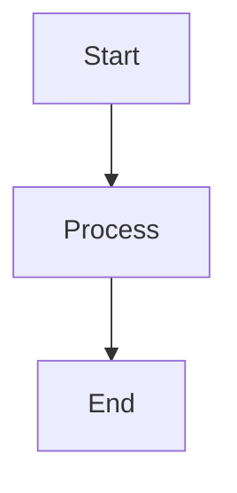

# NeuroCognitive Architecture Documentation

This directory contains the comprehensive documentation for the NeuroCognitive Architecture (NCA) project. The documentation is built using [MkDocs](https://www.mkdocs.org/) with the [Material theme](https://squidfunk.github.io/mkdocs-material/).

## Building the Documentation

### Prerequisites

You need to have Python installed. Then install MkDocs and all required plugins:

```bash
# Install MkDocs and the Material theme
pip install mkdocs mkdocs-material

# Install required plugins
pip install pymdown-extensions
pip install mkdocs-minify-plugin  # Required for the minify plugin
pip install mkdocs-git-revision-date-localized-plugin
pip install mkdocstrings
pip install mkdocs-social-plugin
pip install mkdocs-redirects
pip install mkdocs-awesome-pages-plugin
pip install mkdocs-macros-plugin
```

> **Note on Deprecation Warnings**: You may see a deprecation warning about `materialx.emoji.twemoji`. This is expected, as the Material emoji logic has been moved into mkdocs-material v9.4+. The configuration in `mkdocs.yml` has already been updated to use the new path.

### Directory Structure

The documentation uses a specific directory structure to work with MkDocs:

- `mkdocs.yml`: Configuration file at the root of the docs directory
- `pages/`: Directory containing all the actual documentation markdown files
- `assets/`: Directory for static assets like JS and CSS files

**Important**: MkDocs doesn't allow the docs_dir (where markdown files are located) to be the parent directory of the config file. Therefore, we use the `pages` subdirectory to store all markdown content.

### Setting Up Your Environment

Before running MkDocs for the first time, you need to copy all markdown files to the pages directory:

```bash
# From the Neuroca/docs directory
# Create necessary directories
mkdir -p pages/user pages/api pages/architecture pages/architecture/decisions pages/development pages/operations pages/operations/runbooks pages/health_system pages/langchain

# Copy README.md and index.md to pages directory
cp README.md pages/
cp index.md pages/

# Copy all markdown files from each directory to the corresponding subdirectory in pages
cp user/*.md pages/user/
cp api/*.md pages/api/
cp architecture/*.md pages/architecture/
cp architecture/decisions/*.md pages/architecture/decisions/
cp development/*.md pages/development/
cp operations/*.md pages/operations/
cp operations/runbooks/*.md pages/operations/runbooks/
cp health_system/*.md pages/health_system/
cp langchain/*.md pages/langchain/
```

### Local Development Server

To preview the documentation locally with live reloading:

1. Navigate to the docs directory:

   ```bash
   cd Neuroca/docs
   ```

2. Start the MkDocs development server:

   ```bash
   mkdocs serve
   ```

3. Open your browser and go to <http://127.0.0.1:8000>

The server will automatically reload when you make changes to the documentation.

### Building for Production

To build the static site for production deployment:

1. Navigate to the docs directory:

   ```bash
   cd Neuroca/docs
   ```

2. Build the site:

   ```bash
   mkdocs build
   ```

This will create a `site` directory with the static HTML files. These can be deployed to any static file hosting service.

### Updating Documentation

When adding new documentation:

1. Create your markdown file in the appropriate subdirectory within the `pages/` directory
2. Update the `nav` section in `mkdocs.yml` if needed
3. If creating entirely new sections, you may need to create the corresponding subdirectory in `pages/`

## Documentation Structure

The documentation is organized into several key sections:

- **User Guide**: Information for end-users on how to use the system
- **Architecture**: Detailed description of the system architecture
- **API Reference**: API documentation for developers
- **Development**: Guidelines for contributing to the project
- **Operations**: Instructions for deploying and maintaining the system

## MkDocs Configuration

The `mkdocs.yml` file contains the configuration for the documentation site, including:

- Site metadata (name, description, etc.)
- Theme configuration
- Navigation structure
- Plugins and extensions
- Custom styling and scripts

## Adding New Documentation

1. Create your Markdown file in the appropriate directory
2. Add a reference to your file in the `nav` section of `mkdocs.yml`
3. Make sure to follow the established writing style and formatting

## Writing Guidelines

- Use Markdown for all documentation
- Include code examples when appropriate
- Use admonitions for notes, warnings, etc.
- Create diagrams with Mermaid when useful
- Organize content with clear headings and subheadings

## Diagrams

The documentation supports Mermaid diagrams. You can include them in your Markdown files like this:

```markdown


```

## MathJax

For mathematical formulas, you can use MathJax:

```markdown
$$
f(x) = \int_{-\infty}^{\infty} \hat{f}(\xi) e^{2 \pi i \xi x} d\xi
$$
```

## Getting Help

If you need help with the documentation, please check:

- [MkDocs Documentation](https://www.mkdocs.org/)
- [Material for MkDocs](https://squidfunk.github.io/mkdocs-material/)
- [Python-Markdown](https://python-markdown.github.io/)

Or reach out to the project maintainers.
