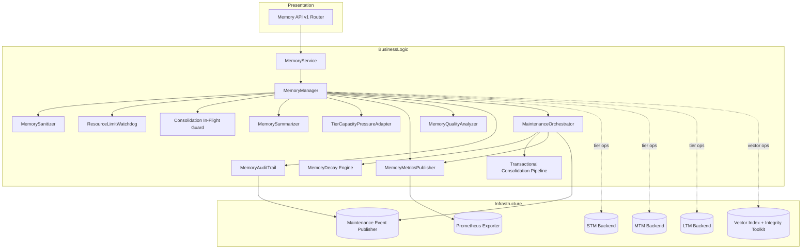

# Memory Manager Architecture

This document captures the post-refactor architecture of the Neuroca memory subsystem. It
focuses on how the versioned API, service façade, orchestration pipelines, and storage tiers
collaborate while respecting the modular-monolith layering rules.

## High-level layout

The diagram illustrates the directional dependencies:

- Presentation entry points invoke only the service façade. The service exposes type-safe
  DTOs and shields outer layers from the internal manager contracts.
- The `MemoryManager` composes orchestration helpers but never depends on infrastructure
  specifics directly; each backend is passed in through the factory adhering to clean
  architecture boundaries.
- Maintenance concerns (decay, consolidation, telemetry) run through the orchestrator so the
  manager does not manage task lifecycles on its own.

## Component responsibilities

| Component | Responsibility highlights |
| --- | --- |
| `MemoryService` | Marshals API requests to manager operations, handles scope assembly, and normalizes responses. |
| `MemoryManager` | Primary business orchestrator coordinating sanitization, capacity gating, maintenance scheduling, and tier access. |
| `MaintenanceOrchestrator` | Drives background cycles, applies adaptive back-off, and dispatches to decay, consolidation, cleanup, and metric emission helpers. |
| `MemoryDecay` | Applies passive half-life decay, reinforcement decay, and forgetting thresholds for MTM/LTM tiers. |
| `TransactionalConsolidationPipeline` | Executes STM→MTM→LTM promotions with staged commits, rollback handlers, and deduplication via the in-flight guard. |
| `MemorySummarizer` | Performs weighted sentence selection and keyword aggregation for LTM promotions. |
| `MemorySanitizer` | Redacts secrets/PII, rejects prompt-injection, and normalizes tag payloads before persistence. |
| `ResourceLimitWatchdog` | Enforces per-tier quotas, eviction rules, and ingest timeouts to prevent overload. |
| `TierCapacityPressureAdapter` | Computes rolling utilization and tunes consolidation thresholds dynamically. |
| `MemoryMetricsPublisher` | Emits promotion, decay, backlog, and utilization metrics to Prometheus. |
| `MemoryQualityAnalyzer` | Scores redundancy, staleness, and embedding drift; feeds maintenance reporting. |
| `MemoryAuditTrail` | Produces redacted audit logs and structured `MemoryCreated`/`MemoryConsolidated` events. |

## Data flow summary

1. **Ingestion** – The API receives a create/update request, resolves scopes via the service, and
   invokes `MemoryManager.add_memory`. The manager sanitizes content, enforces capacity limits,
   persists into STM, and emits audit events/metrics.
2. **Maintenance cycles** – A background scheduler triggers the orchestrator, which batches
   consolidation candidates, runs decay passes, reindexes vectors when required, and publishes
   metrics plus structured events for observability pipelines.
3. **Retrieval** – Queries flow through the service scopes into the manager, which coordinates tier
   lookups (including semantic search via the vector backend) and normalizes outputs under the v1
   contract models.
4. **Quality feedback** – After each maintenance cycle, the quality analyzer and metrics publisher
   provide telemetry that the orchestrator feeds into adaptive delay calculations and external
   dashboards.

Refer to the associated module docs for implementation specifics:

- `src/neuroca/api/routes/memory_v1.py` – versioned router exposing the contract.
- `src/neuroca/memory/manager/memory_manager.py` – manager composition root.
- `src/neuroca/memory/manager/maintenance.py` – maintenance orchestrator.
- `src/neuroca/memory/manager/metrics.py` – Prometheus publisher wiring.
