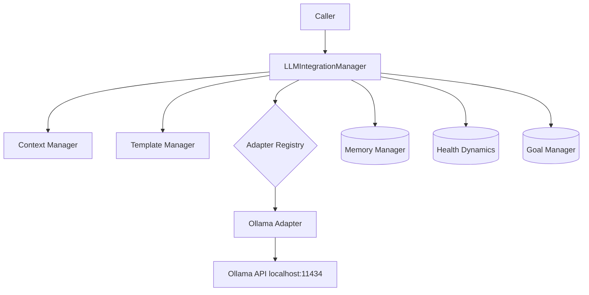

# Neuroca Local LLM Enablement Plan

This document specifies the changes, specs, and milestones to get Neuroca working end-to-end with local LLMs (Ollama first), plus a path to optional OpenAI-compatible local endpoints.

## Goals and Definition of Done

Goals:
- Provide a stable, documented path to run Neuroca against a locally running LLM (Ollama).
- Unify request/response types across adapters and manager.
- Align the adapter registry and provider initialization.

Definition of Done:
- manager.query(provider="ollama") returns a populated, canonical response using a local model.
- Adapters register without import or symbol errors.
- Quickstart and example config enable a new user to run a prompt in under 5 minutes.
- Unit tests for the Ollama path pass; one integration smoke test validates end-to-end flow.

## Architecture (as-intended)

Key code points:
- Manager entrypoint: [python.method LLMIntegrationManager.query()](./_Neuroca/src/neuroca/integration/manager.py:129)
- Base adapter interface: [python.class BaseAdapter()](./_Neuroca/src/neuroca/integration/adapters/base.py:235)
- Adapter registry: [python.class AdapterRegistry()](./_Neuroca/src/neuroca/integration/adapters/base.py:452)
- Canonical models: [python.class LLMRequest()](./_Neuroca/src/neuroca/integration/models.py:115), [python.class LLMResponse()](./_Neuroca/src/neuroca/integration/models.py:157), [python.class ResponseType()](./_Neuroca/src/neuroca/integration/models.py:22)
- Templates: [python.class TemplateManager()](./_Neuroca/src/neuroca/integration/prompts/templates.py:113), [python.method TemplateManager.render_template()](./_Neuroca/src/neuroca/integration/prompts/templates.py:418)
- Ollama adapter: [python.class OllamaAdapter()](./_Neuroca/src/neuroca/integration/adapters/ollama.py:45), [python.method OllamaAdapter.execute()](./_Neuroca/src/neuroca/integration/adapters/ollama.py:167)

## Current Gaps blocking local LLMs

- Duplicate response types: base also defines [python.class LLMResponse()](./_Neuroca/src/neuroca/integration/adapters/base.py:182) and [python.class ResponseType()](./_Neuroca/src/neuroca/integration/adapters/base.py:103) conflicting with models.
- Registry API mismatch: adapters/__init__.py expects register_adapter_class not provided by base.
- Base interface vs manager: Base lacks execute(request) while manager calls it.
- Constructor/config mismatch between manager and adapters (dicts vs structured config).
- Cloud adapters (OpenAI/Anthropic/Vertex AI) have import and async/sync issues; disable or refactor later.
- No example provider config or quickstart for local models.
- Tests missing for the local path.

## Specifications and Required Changes

1) Unify types on integration/models.py
- Requirement:
  - Remove or stop exporting duplicate types from base; all adapters and manager import:
    - [python.class LLMRequest()](./_Neuroca/src/neuroca/integration/models.py:115)
    - [python.class LLMResponse()](./_Neuroca/src/neuroca/integration/models.py:157)
    - [python.class ResponseType()](./_Neuroca/src/neuroca/integration/models.py:22)
- Changes:
  - In base, delete or deprecate [python.class LLMResponse()](./_Neuroca/src/neuroca/integration/adapters/base.py:182) and [python.class ResponseType()](./_Neuroca/src/neuroca/integration/adapters/base.py:103) and import from models instead.
  - Ensure Ollama adapter continues to return models.LLMResponse.
- Acceptance:
  - No references to base.LLMResponse/base.ResponseType remain.

2) Normalize the BaseAdapter interface
- Requirement:
  - Add a standard entrypoint: execute(self, request: LLMRequest) -> LLMResponse.
- Changes:
  - Add abstract [python.method BaseAdapter.execute()](./_Neuroca/src/neuroca/integration/adapters/base.py:235) signature next to generate/generate_chat/generate_embedding.
  - Optionally add a default non-abstract implementation that dispatches to generate/generate_chat/… based on request fields.
- Acceptance:
  - manager calls adapters via execute(request) consistently.

3) Fix AdapterRegistry and registration
- Requirement:
  - Align adapters/__init__.py with the real registry API or provide a wrapper.
- Changes:
  - Option A: In base, add a simple alias method register_adapter_class(name, cls) that calls [python.method AdapterRegistry.register()](./_Neuroca/src/neuroca/integration/adapters/base.py:461).
  - Option B: Update ['_Neuroca/src/neuroca/integration/adapters/__init__.py'](./_Neuroca/src/neuroca/integration/adapters/__init__.py) to use [python.method AdapterRegistry.register()](./_Neuroca/src/neuroca/integration/adapters/base.py:461) and [python.method AdapterRegistry.list_adapters()](./_Neuroca/src/neuroca/integration/adapters/base.py:531).
  - Remove imports of non-existent symbols (AdapterExecutionError, ModelCapability) from adapters/__init__.py.
- Acceptance:
  - Importing adapters/__init__.py registers Ollama without warnings or stubs.

4) Make Ollama the working local backend
- Changes (if needed):
  - Confirm [python.method OllamaAdapter.execute()](./_Neuroca/src/neuroca/integration/adapters/ollama.py:167) returns models.LLMResponse in all paths.
  - Ensure [python.method OllamaAdapter.generate()](./_Neuroca/src/neuroca/integration/adapters/ollama.py:267), [python.method OllamaAdapter.generate_chat()](./_Neuroca/src/neuroca/integration/adapters/ollama.py:303), [python.method OllamaAdapter.generate_embedding()](./_Neuroca/src/neuroca/integration/adapters/ollama.py:369) consistently wrap to execute or construct canonical responses.
  - Keep .close() awaited by manager [python.method LLMIntegrationManager.close()](./_Neuroca/src/neuroca/integration/manager.py:473).
- Acceptance:
  - With Ollama running and a model pulled, a simple prompt returns text and metadata.

5) Align LLMIntegrationManager
- Changes:
  - In [python.method LLMIntegrationManager._initialize_adapters()](./_Neuroca/src/neuroca/integration/manager.py:92), instantiate only available, working adapters; for now Ollama (and optionally others behind flags).
  - Ensure [python.method LLMIntegrationManager.query()](./_Neuroca/src/neuroca/integration/manager.py:129) keeps building [python.class LLMRequest()](./_Neuroca/src/neuroca/integration/models.py:115) and calls adapter.execute(request).
  - Validate prompt template rendering via [python.method TemplateManager.render_template()](./_Neuroca/src/neuroca/integration/prompts/templates.py:418) with template id base_enhancement.
- Acceptance:
  - query() returns a canonical LLMResponse and updates internal metrics.

6) Configuration and Quickstart
- Add example config at ['_Neuroca/config/example.local-llm.yaml'](_Neuroca/config/example.local-llm.yaml):
  - default_provider: ollama
  - default_model: gemma3:4b
  - providers:
      ollama:
        base_url: http://localhost:11434
        default_model: gemma3:4b
        request_timeout: 120
        max_retries: 3
- Add quickstart doc at ['_Neuroca/docs/guides/local-llm-quickstart.md'](_Neuroca/docs/guides/local-llm-quickstart.md) with:
  - Install Ollama, pull a model.
  - Start server and run a minimal Python snippet invoking manager.query(provider="ollama").
  - Troubleshooting (connection errors, missing model).

7) Tests
- Unit tests under ['_Neuroca/tests/unit/integration'](_Neuroca/tests/unit/integration):
  - Ollama payload building and response parsing (mock aiohttp).
- Integration smoke test under ['_Neuroca/tests/integration'](_Neuroca/tests/integration):
  - If CI cannot run Ollama, use a recorded fixture; otherwise, run against localhost:11434.
- Ensure coverage for error branches: non-200, invalid JSON, connection errors.

8) Optional: OpenAI-compatible local endpoints
- Add a thin “OpenAI-compatible” adapter to support LM Studio, vLLM, llama.cpp server, KoboldCPP when they expose an OpenAI-like API.
- Register behind a feature flag; document configuration.

## Work Plan, Milestones, and Estimates

Phase 0 — Type & Registry Unification (0.5–1 day)
- Remove duplicate types in base; import models.* everywhere.
- Add/align execute() in BaseAdapter and fix adapters/__init__.py registration.

Phase 1 — Ollama Path (0.5 day)
- Verify/adjust Ollama adapter returns canonical responses.
- Manager uses execute(); keep only working adapters active.

Phase 2 — Config, Docs, Tests (1–1.5 days)
- Add example.local-llm.yaml and quickstart guide.
- Unit tests for Ollama; one integration smoke.

Phase 3 — Optional generic OpenAI-compatible adapter (0.5–1 day)
- Single adapter to target multiple local servers exposing OpenAI API.

Total estimate: 2–3 days for Phases 0–2 (local path), +0.5–1 day optional Phase 3.

## Risks and Mitigations
- Mixed sync/async in cloud adapters:
  - Mitigation: Do not register non-functional adapters until refactored.
- Template variable mismatches:
  - Mitigation: Document variables injected by manager and validate base_enhancement.j2 renders.
- Changes touching multiple modules:
  - Mitigation: Keep changes scoped, add tests, and use feature flags for optional adapters.

## Files & APIs to modify (summary)
- Base:
  - ['_Neuroca/src/neuroca/integration/adapters/base.py'](./_Neuroca/src/neuroca/integration/adapters/base.py)
    - Remove duplicate types and import models.*; add execute() to [python.class BaseAdapter()](./_Neuroca/src/neuroca/integration/adapters/base.py:235).
    - Provide register_adapter_class alias or update callers to [python.method AdapterRegistry.register()](./_Neuroca/src/neuroca/integration/adapters/base.py:461).
- Adapters init:
  - ['_Neuroca/src/neuroca/integration/adapters/__init__.py'](./_Neuroca/src/neuroca/integration/adapters/__init__.py)
    - Stop importing non-existent symbols; align registry calls.
- Ollama:
  - ['_Neuroca/src/neuroca/integration/adapters/ollama.py'](./_Neuroca/src/neuroca/integration/adapters/ollama.py)
    - Ensure all public methods return models.LLMResponse and metadata is consistent.
- Manager:
  - ['_Neuroca/src/neuroca/integration/manager.py'](./_Neuroca/src/neuroca/integration/manager.py)
    - Initialize only working adapters; keep execute() path; ensure prompt template lookup.
- Docs & Config:
  - ['_Neuroca/config/example.local-llm.yaml'](_Neuroca/config/example.local-llm.yaml)
  - ['_Neuroca/docs/guides/local-llm-quickstart.md'](_Neuroca/docs/guides/local-llm-quickstart.md)
- Tests:
  - ['_Neuroca/tests/unit/integration'](_Neuroca/tests/unit/integration)
  - ['_Neuroca/tests/integration'](_Neuroca/tests/integration)

## Execution Checklist (for tracking)
- [ ] Remove base type duplicates; import models.* in base and adapters.
- [ ] Add/standardize BaseAdapter.execute(LLMRequest) -> LLMResponse.
- [ ] Align adapters/__init__.py to registry; register Ollama only.
- [ ] Verify Ollama adapter’s execute/generate paths return canonical responses.
- [ ] Manager uses execute(); initialize providers based on config; default to ollama.
- [ ] Add example.local-llm.yaml and local-llm-quickstart.md.
- [ ] Add unit tests for Ollama adapter and one integration smoke test.
- [ ] Optional: add OpenAI-compatible generic local adapter.

Appendix: Reference snippets
- Manager call path: [python.method LLMIntegrationManager.query()](./_Neuroca/src/neuroca/integration/manager.py:129)
- Template rendering: [python.method TemplateManager.render_template()](./_Neuroca/src/neuroca/integration/prompts/templates.py:418)
- Registry: [python.method AdapterRegistry.register()](./_Neuroca/src/neuroca/integration/adapters/base.py:461), [python.method AdapterRegistry.get_adapter()](./_Neuroca/src/neuroca/integration/adapters/base.py:512), [python.method AdapterRegistry.list_adapters()](./_Neuroca/src/neuroca/integration/adapters/base.py:531)
- Ollama methods: [python.method OllamaAdapter.execute()](./_Neuroca/src/neuroca/integration/adapters/ollama.py:167), [python.method OllamaAdapter.generate_embedding()](./_Neuroca/src/neuroca/integration/adapters/ollama.py:369)

End of plan.