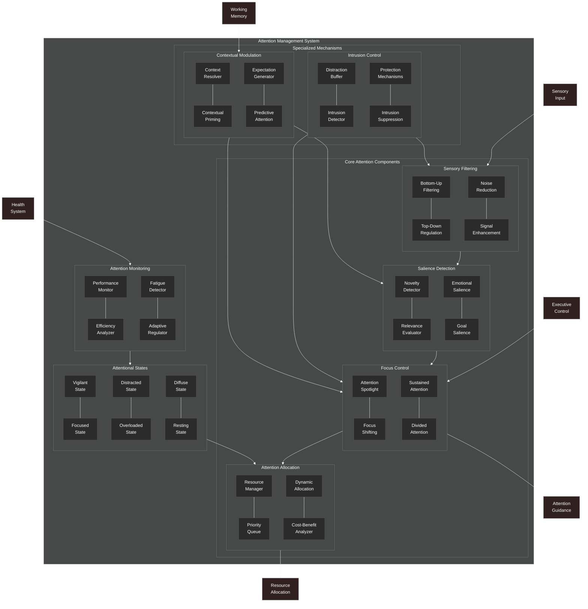

# Attention Management Architecture

This diagram provides a detailed view of the NeuroCognitive Architecture (NCA) attention management subsystem.

## Attention Management Architecture Components

The NCA attention management subsystem provides mechanisms for directing and controlling attention, allowing the system to focus on relevant information while filtering out distractions. It consists of the following key components:

### Core Attention Components

1. **Focus Control**:
   - **Attention Spotlight**: Directs the focus of attention to specific information
   - **Focus Shifting**: Moves attention between different information sources
   - **Sustained Attention**: Maintains focus on a specific target over time
   - **Divided Attention**: Manages focus on multiple targets simultaneously

2. **Sensory Filtering**:
   - **Bottom-Up Filtering**: Automatic filtering based on sensory properties
   - **Top-Down Regulation**: Controlled filtering based on goals and expectations
   - **Noise Reduction**: Reduces irrelevant sensory information
   - **Signal Enhancement**: Enhances relevant sensory information

3. **Salience Detection**:
   - **Novelty Detector**: Identifies novel or unexpected information
   - **Relevance Evaluator**: Assesses information relevance to current goals
   - **Emotional Salience**: Detects emotionally significant information
   - **Goal Salience**: Detects information relevant to current goals

4. **Attention Allocation**:
   - **Resource Manager**: Manages the allocation of attention resources
   - **Priority Queue**: Prioritizes items for attention allocation
   - **Dynamic Allocation**: Adjusts allocation based on changing conditions
   - **Cost-Benefit Analyzer**: Evaluates the costs and benefits of attention allocation

### Specialized Mechanisms

1. **Intrusion Control**:
   - **Distraction Buffer**: Temporarily holds potential distractions
   - **Intrusion Detector**: Detects unwanted information intrusions
   - **Protection Mechanisms**: Protects focused attention from disruption
   - **Intrusion Suppression**: Actively suppresses intrusive information

2. **Contextual Modulation**:
   - **Context Resolver**: Determines the current context for attention
   - **Contextual Priming**: Primes attention based on context
   - **Expectation Generator**: Generates expectations about upcoming information
   - **Predictive Attention**: Directs attention based on predictions

### Attentional States

The system can be in various attentional states:
- **Vigilant State**: Heightened awareness and alertness
- **Focused State**: Concentrated attention on specific items
- **Distracted State**: Attention disrupted by irrelevant information
- **Overloaded State**: Excessive demands on attention resources
- **Diffuse State**: Broadly distributed, unfocused attention
- **Resting State**: Minimal attentional engagement

### Attention Monitoring

1. **Performance Monitor**: Tracks the performance of the attention system
2. **Efficiency Analyzer**: Evaluates attention efficiency
3. **Fatigue Detector**: Detects attention fatigue
4. **Adaptive Regulator**: Regulates attention based on current conditions

### External Connections

The attention management system connects with:
- **Executive Control**: Provides top-down control of attention
- **Working Memory**: Provides context for attention allocation
- **Sensory Input**: Provides information for bottom-up attention
- **Health System**: Provides health state for attention regulation

### Output Connections

The attention management system produces:
- **Resource Allocation**: Allocation of cognitive resources based on attention
- **Attention Guidance**: Guidance for other systems based on attentional focus

The attention management system is designed to adaptively control information processing, enhancing relevant information and suppressing distractions in a way inspired by human attentional mechanisms.
