# Decision Making Architecture

This diagram provides a detailed view of the NeuroCognitive Architecture (NCA) decision-making components.

```mermaid
%%{init: {'theme': 'dark', 'themeVariables': { 'primaryColor': '#242424', 'primaryTextColor': '#fff', 'primaryBorderColor': '#555', 'lineColor': '#f8f8f8', 'secondaryColor': '#2b2b2b', 'tertiaryColor': '#1a1a1a'}}}%%
graph TB
    classDef main fill:#1a1a1a,stroke:#555,color:#fff
    classDef component fill:#242424,stroke:#555,color:#fff
    classDef subcomponent fill:#2b2b2b,stroke:#555,color:#fff
    classDef evaluation fill:#203040,stroke:#555,color:#fff
    classDef reasoning fill:#302030,stroke:#555,color:#fff
    classDef utility fill:#203020,stroke:#555,color:#fff
    classDef selection fill:#302020,stroke:#555,color:#fff
    classDef external fill:#383838,stroke:#555,color:#fff

    subgraph DecisionSystem["Decision Making System"]
        direction TB
        class DecisionSystem main
        
        subgraph CoreComponents["Core Decision Components"]
            direction TB
            class CoreComponents component
            
            subgraph OptionEvaluation["Option Evaluation"]
                direction TB
                class OptionEvaluation evaluation
                FeatureExtraction[Feature<br>Extraction] --- FeatureAnalysis[Feature<br>Analysis]
                MultiCriteriaEval[Multi-Criteria<br>Evaluation] --- ConsistencyChecks[Consistency<br>Checks]
                class FeatureExtraction,FeatureAnalysis,MultiCriteriaEval,ConsistencyChecks subcomponent
            end
            
            subgraph ReasoningEngine["Reasoning Engine"]
                direction TB
                class ReasoningEngine reasoning
                LogicalReasoning[Logical<br>Reasoning] --- CausalReasoning[Causal<br>Reasoning]
                InductiveReasoning[Inductive<br>Reasoning] --- DeductiveReasoning[Deductive<br>Reasoning]
                AbstractReasoning[Abstract<br>Reasoning] --- AnalogyReasoning[Analogy<br>Reasoning]
                class LogicalReasoning,CausalReasoning,InductiveReasoning,DeductiveReasoning,AbstractReasoning,AnalogyReasoning subcomponent
            end
            
            subgraph UtilityCalculation["Utility Calculation"]
                direction TB
                class UtilityCalculation utility
                CostComputation[Cost<br>Computation] --- BenefitComputation[Benefit<br>Computation]
                RiskAnalysis[Risk<br>Analysis] --- RewardEvaluation[Reward<br>Evaluation]
                DiscountingMechanism[Discounting<br>Mechanism] --- ProbabilityWeighting[Probability<br>Weighting]
                class CostComputation,BenefitComputation,RiskAnalysis,RewardEvaluation,DiscountingMechanism,ProbabilityWeighting subcomponent
            end
            
            subgraph OptionSelection["Option Selection"]
                direction TB
                class OptionSelection selection
                MaxUtilitySelector[Max Utility<br>Selector] --- ProbabilisticSelector[Probabilistic<br>Selector]
                SatisficingSelector[Satisficing<br>Selector] --- MultiObjectiveOptimizer[Multi-Objective<br>Optimizer]
                ThresholdBasedSelector[Threshold-Based<br>Selector] --- HeuristicSelector[Heuristic<br>Selector]
                class MaxUtilitySelector,ProbabilisticSelector,SatisficingSelector,MultiObjectiveOptimizer,ThresholdBasedSelector,HeuristicSelector subcomponent
            end
        end
        
        subgraph CognitiveInfluences["Cognitive Influences"]
            direction TB
            class CognitiveInfluences component
            
            subgraph CognitiveBiases["Cognitive Biases"]
                direction TB
                class CognitiveBiases reasoning
                ConfirmationBias[Confirmation<br>Bias] --- AnchoringBias[Anchoring<br>Bias]
                AvailabilityBias[Availability<br>Bias] --- SunkCostBias[Sunk Cost<br>Bias]
                FramingBias[Framing<br>Bias] --- StatusQuoBias[Status Quo<br>Bias]
                class ConfirmationBias,AnchoringBias,AvailabilityBias,SunkCostBias,FramingBias,StatusQuoBias subcomponent
            end
            
            subgraph EmotionalProcessing["Emotional Processing"]
                direction TB
                class EmotionalProcessing utility
                EmotionalAppraisal[Emotional<br>Appraisal] --- EmotionalRegulation[Emotional<br>Regulation]
                AffectiveForecasting[Affective<br>Forecasting] --- EmotionalMemory[Emotional<br>Memory]
                class EmotionalAppraisal,EmotionalRegulation,AffectiveForecasting,EmotionalMemory subcomponent
            end
            
            subgraph SocialFactors["Social Factors"]
                direction TB
                class SocialFactors utility
                NormAlignment[Norm<br>Alignment] --- SocialUtility[Social<br>Utility]
                Fairness[Fairness<br>Assessment] --- Reciprocity[Reciprocity<br>Mechanisms]
                class NormAlignment,SocialUtility,Fairness,Reciprocity subcomponent
            end
        end
        
        subgraph ExecutiveMonitoring["Executive Monitoring"]
            direction TB
            class ExecutiveMonitoring component
            ConfidenceEstimation[Confidence<br>Estimation] --- UncertaintyQuantification[Uncertainty<br>Quantification]
            ConflictDetection[Conflict<br>Detection] --- ErrorMonitoring[Error<br>Monitoring]
            class ConfidenceEstimation,UncertaintyQuantification,ConflictDetection,ErrorMonitoring subcomponent
        end
        
        subgraph DecisionStrategies["Decision Strategies"]
            direction TB
            class DecisionStrategies component
            CompensatoryStrategies[Compensatory<br>Strategies] --- NonCompensatoryStrategies[Non-Compensatory<br>Strategies]
            ExplorationStrategies[Exploration<br>Strategies] --- ExploitationStrategies[Exploitation<br>Strategies]
            AdaptiveStrategies[Adaptive<br>Strategies] --- MetaDecisionStrategies[Meta-Decision<br>Strategies]
            class CompensatoryStrategies,NonCompensatoryStrategies,ExplorationStrategies,ExploitationStrategies,AdaptiveStrategies,MetaDecisionStrategies subcomponent
        end
    end
    
    %% External connections
    Goals[Goal<br>System] --> OptionEvaluation
    Memory[Memory<br>System] --> ReasoningEngine
    HealthSystem[Health<br>System] --> EmotionalProcessing
    AttentionSystem[Attention<br>System] --> OptionSelection
    
    %% Internal connections
    OptionEvaluation --> UtilityCalculation
    ReasoningEngine --> OptionEvaluation
    UtilityCalculation --> OptionSelection
    CognitiveBiases --> UtilityCalculation
    EmotionalProcessing --> UtilityCalculation
    SocialFactors --> UtilityCalculation
    ExecutiveMonitoring --> OptionSelection
    DecisionStrategies --> OptionSelection
    
    %% Bidirectional connections
    ReasoningEngine <--> CognitiveBiases
    ExecutiveMonitoring <--> DecisionStrategies
    
    %% Output connections
    OptionSelection --> DecisionOutput[Decision<br>Output]
    ExecutiveMonitoring --> ConfidenceOutput[Confidence<br>Output]
    
    %% Node styling
    class Goals,Memory,HealthSystem,AttentionSystem,DecisionOutput,ConfidenceOutput external
```

## Decision Making System Components

The NCA decision-making system provides mechanisms for evaluating options, reasoning about choices, calculating utilities, and selecting optimal actions. It consists of the following key components:

### Core Decision Components

1. **Option Evaluation**:
   - **Feature Extraction**: Extracts relevant features from options
   - **Feature Analysis**: Analyzes the extracted features
   - **Multi-Criteria Evaluation**: Evaluates options against multiple criteria
   - **Consistency Checks**: Checks for consistency in evaluations

2. **Reasoning Engine**:
   - **Logical Reasoning**: Applies formal logic to decision-making
   - **Causal Reasoning**: Reasons about cause-effect relationships
   - **Inductive Reasoning**: Generates conclusions from specific observations
   - **Deductive Reasoning**: Applies general rules to specific instances
   - **Abstract Reasoning**: Handles abstract concepts and relationships
   - **Analogy Reasoning**: Reasons using analogies and similarities

3. **Utility Calculation**:
   - **Cost Computation**: Calculates costs of options
   - **Benefit Computation**: Calculates benefits of options
   - **Risk Analysis**: Analyzes risks associated with options
   - **Reward Evaluation**: Evaluates potential rewards
   - **Discounting Mechanism**: Applies temporal discounting to future outcomes
   - **Probability Weighting**: Weights outcomes by their probabilities

4. **Option Selection**:
   - **Max Utility Selector**: Selects the option with maximum utility
   - **Probabilistic Selector**: Makes selections probabilistically based on utility
   - **Satisficing Selector**: Selects the first option that meets criteria
   - **Multi-Objective Optimizer**: Optimizes across multiple objectives
   - **Threshold-Based Selector**: Selects options based on thresholds
   - **Heuristic Selector**: Uses heuristics for rapid selection

### Cognitive Influences

1. **Cognitive Biases**:
   - **Confirmation Bias**: Preference for confirming existing beliefs
   - **Anchoring Bias**: Over-reliance on initial information
   - **Availability Bias**: Overestimation of easily recalled information
   - **Sunk Cost Bias**: Consideration of unrecoverable past costs
   - **Framing Bias**: Influence of how options are presented
   - **Status Quo Bias**: Preference for the current state

2. **Emotional Processing**:
   - **Emotional Appraisal**: Evaluates emotional significance
   - **Emotional Regulation**: Regulates emotional impact on decisions
   - **Affective Forecasting**: Predicts future emotional states
   - **Emotional Memory**: Uses emotional memory in decisions

3. **Social Factors**:
   - **Norm Alignment**: Aligns decisions with social norms
   - **Social Utility**: Considers social outcomes in utility
   - **Fairness Assessment**: Evaluates fairness of outcomes
   - **Reciprocity Mechanisms**: Considers reciprocal relationships

### Executive Monitoring

1. **Confidence Estimation**: Estimates confidence in decisions
2. **Uncertainty Quantification**: Quantifies uncertainty in decisions
3. **Conflict Detection**: Detects conflicts in decision processes
4. **Error Monitoring**: Monitors for decision errors

### Decision Strategies

1. **Compensatory Strategies**: Balances strengths and weaknesses across attributes
2. **Non-Compensatory Strategies**: Uses attribute-specific rules without compensation
3. **Exploration Strategies**: Focuses on exploring unknown options
4. **Exploitation Strategies**: Focuses on exploiting known options
5. **Adaptive Strategies**: Adapts strategies based on context
6. **Meta-Decision Strategies**: Decides how to make decisions

### External Connections

The decision-making system connects with:
- **Goal System**: For goal-directed decision-making
- **Memory System**: For retrieving relevant information
- **Health System**: For health-aware decision-making
- **Attention System**: For focusing on relevant aspects of decisions

### Output Connections

The decision-making system produces:
- **Decision Output**: Final selected decision
- **Confidence Output**: Confidence in the decision

The decision-making system is designed to provide flexible, context-aware decision capabilities that can balance rational computation with cognitive biases and emotional factors, inspired by human decision-making processes.
