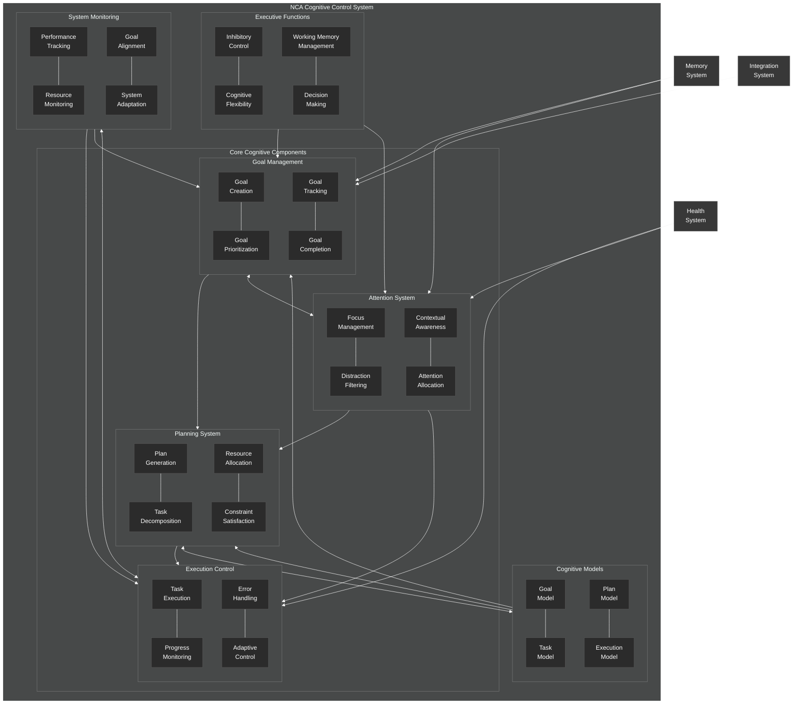

# Cognitive Control System Overview

This diagram provides a comprehensive overview of the NeuroCognitive Architecture (NCA) cognitive control system.

## Cognitive Control System Components

The NCA cognitive control system provides the executive functions and goal-directed processing capabilities of the architecture. It consists of the following key components:

### Core Cognitive Components

1. **Goal Management**:
   - **Goal Creation**: Processes for creating new goals
   - **Goal Prioritization**: Algorithms for prioritizing goals
   - **Goal Tracking**: Mechanisms for tracking goal progress
   - **Goal Completion**: Processes for completing goals

2. **Attention System**:
   - **Focus Management**: Manages focus on relevant information
   - **Distraction Filtering**: Filters out distractions
   - **Contextual Awareness**: Maintains awareness of context
   - **Attention Allocation**: Allocates attention resources

3. **Planning System**:
   - **Plan Generation**: Generates plans to achieve goals
   - **Task Decomposition**: Breaks down complex tasks
   - **Resource Allocation**: Allocates resources to tasks
   - **Constraint Satisfaction**: Ensures plans satisfy constraints

4. **Execution Control**:
   - **Task Execution**: Controls task execution
   - **Progress Monitoring**: Monitors execution progress
   - **Error Handling**: Handles execution errors
   - **Adaptive Control**: Adapts execution based on feedback

### Cognitive Models

1. **Goal Model**: Model for representing goals
2. **Task Model**: Model for representing tasks
3. **Plan Model**: Model for representing plans
4. **Execution Model**: Model for representing execution state

### Executive Functions

1. **Inhibitory Control**: Controls impulsive actions
2. **Cognitive Flexibility**: Adapts to changing conditions
3. **Working Memory Management**: Manages working memory
4. **Decision Making**: Makes decisions based on goals and context

### System Monitoring

1. **Performance Tracking**: Tracks system performance
2. **Resource Monitoring**: Monitors resource usage
3. **Goal Alignment**: Ensures alignment with goals
4. **System Adaptation**: Adapts system behavior

### External Connections

The cognitive control system connects with:
- **Memory System**: For retrieving and storing information
- **Health System**: For health-aware adaptation
- **Integration System**: For goal-directed prompting

The cognitive control system is designed to provide the high-level executive functions of the NCA, coordinating the activities of other systems to achieve goals in an adaptive and flexible manner.
