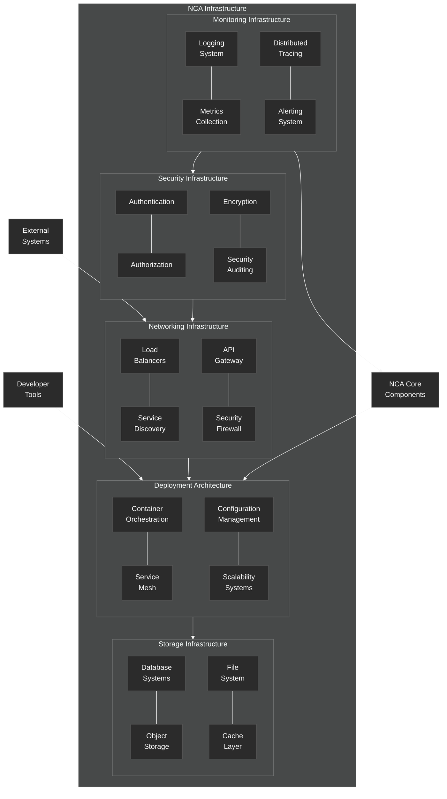

# Infrastructure Architecture

Overview of the infrastructure architecture for the NeuroCognitive Architecture.

## Infrastructure Architecture Components

The Infrastructure Architecture provides the foundation for deploying, running, and managing the NeuroCognitive Architecture system.

### Deployment Architecture

- **Container Orchestration**: Manages containerized deployment (e.g., Kubernetes)
- **Service Mesh**: Handles service-to-service communication
- **Configuration Management**: Manages system configuration across environments
- **Scalability Systems**: Enables horizontal and vertical scaling of components

### Monitoring Infrastructure

- **Logging System**: Collects and manages system logs
- **Metrics Collection**: Gathers performance and operational metrics
- **Distributed Tracing**: Traces requests across distributed components
- **Alerting System**: Generates alerts on system issues

### Storage Infrastructure

- **Database Systems**: Manages structured data storage
- **Object Storage**: Stores unstructured objects (like embeddings)
- **File System**: Handles file-based storage
- **Cache Layer**: Provides caching for improved performance

### Networking Infrastructure

- **Load Balancers**: Distributes traffic across instances
- **Service Discovery**: Enables components to find each other
- **API Gateway**: Manages external API access
- **Security Firewall**: Protects against network threats

### Security Infrastructure

- **Authentication**: Verifies user identities
- **Authorization**: Controls access to resources
- **Encryption**: Protects data in transit and at rest
- **Security Auditing**: Records security-relevant events

The Infrastructure Architecture serves as the foundation upon which the NCA Core Components run. It interfaces with External Systems through the Networking layer and with Developer Tools through the Deployment layer. The architecture is designed to be scalable, resilient, and secure, providing the necessary infrastructure services for the cognitive architecture components.
