# Integration APIs Architecture

This diagram provides a detailed view of the NeuroCognitive Architecture (NCA) integration APIs.

```mermaid
%%{init: {'theme': 'dark', 'themeVariables': { 'primaryColor': '#242424', 'primaryTextColor': '#fff', 'primaryBorderColor': '#555', 'lineColor': '#f8f8f8', 'secondaryColor': '#2b2b2b', 'tertiaryColor': '#1a1a1a'}}}%%
graph TB
    classDef main fill:#1a1a1a,stroke:#555,color:#fff
    classDef component fill:#242424,stroke:#555,color:#fff
    classDef subcomponent fill:#2b2b2b,stroke:#555,color:#fff
    classDef rest fill:#203040,stroke:#555,color:#fff
    classDef graphql fill:#302030,stroke:#555,color:#fff
    classDef websocket fill:#203020,stroke:#555,color:#fff
    classDef sdk fill:#302020,stroke:#555,color:#fff
    classDef external fill:#383838,stroke:#555,color:#fff

    subgraph IntegrationAPIs["Integration APIs"]
        direction TB
        class IntegrationAPIs main
        
        subgraph RESTAPIs["REST APIs"]
            direction TB
            class RESTAPIs rest
            
            subgraph MemoryAPI["Memory API"]
                direction TB
                class MemoryAPI rest
                MemoryStorage[Memory<br>Storage] --- MemoryRetrieval[Memory<br>Retrieval]
                MemoryQuery[Memory<br>Query] --- MemoryManagement[Memory<br>Management]
                class MemoryStorage,MemoryRetrieval,MemoryQuery,MemoryManagement subcomponent
            end
            
            subgraph LLMAPI["LLM API"]
                direction TB
                class LLMAPI rest
                LLMQuery[LLM<br>Query] --- LLMCompletion[LLM<br>Completion]
                LLMEmbedding[LLM<br>Embedding] --- LLMManagement[LLM<br>Management]
                class LLMQuery,LLMCompletion,LLMEmbedding,LLMManagement subcomponent
            end
            
            subgraph HealthAPI["Health API"]
                direction TB
                class HealthAPI rest
                HealthStatus[Health<br>Status] --- HealthMetrics[Health<br>Metrics]
                HealthConfig[Health<br>Configuration] --- HealthAlerts[Health<br>Alerts]
                class HealthStatus,HealthMetrics,HealthConfig,HealthAlerts subcomponent
            end
            
            subgraph SystemAPI["System API"]
                direction TB
                class SystemAPI rest
                SystemStatus[System<br>Status] --- SystemConfig[System<br>Configuration]
                SystemResources[System<br>Resources] --- SystemControl[System<br>Control]
                class SystemStatus,SystemConfig,SystemResources,SystemControl subcomponent
            end
        end
        
        subgraph GraphQLAPIs["GraphQL APIs"]
            direction TB
            class GraphQLAPIs graphql
            
            subgraph DataGraphQL["Data GraphQL"]
                direction TB
                class DataGraphQL graphql
                EntityQuery[Entity<br>Query] --- EntityMutation[Entity<br>Mutation]
                RelationshipQuery[Relationship<br>Query] --- ComplexQuery[Complex<br>Query]
                class EntityQuery,EntityMutation,RelationshipQuery,ComplexQuery subcomponent
            end
            
            subgraph CognitiveGraphQL["Cognitive GraphQL"]
                direction TB
                class CognitiveGraphQL graphql
                CognitiveQuery[Cognitive<br>Query] --- CognitiveMutation[Cognitive<br>Mutation]
                CognitiveSubscription[Cognitive<br>Subscription] --- CognitiveIntrospection[Cognitive<br>Introspection]
                class CognitiveQuery,CognitiveMutation,CognitiveSubscription,CognitiveIntrospection subcomponent
            end
        end
        
        subgraph WebsocketAPIs["Websocket APIs"]
            direction TB
            class WebsocketAPIs websocket
            
            subgraph EventStream["Event Stream"]
                direction TB
                class EventStream websocket
                SystemEvents[System<br>Events] --- HealthEvents[Health<br>Events]
                MemoryEvents[Memory<br>Events] --- CognitiveEvents[Cognitive<br>Events]
                class SystemEvents,HealthEvents,MemoryEvents,CognitiveEvents subcomponent
            end
            
            subgraph StreamingAPI["Streaming API"]
                direction TB
                class StreamingAPI websocket
                LLMStreaming[LLM<br>Streaming] --- ProcessStreaming[Process<br>Streaming]
                MetricStreaming[Metric<br>Streaming] --- LogStreaming[Log<br>Streaming]
                class LLMStreaming,ProcessStreaming,MetricStreaming,LogStreaming subcomponent
            end
        end
        
        subgraph SDKs["SDK Integrations"]
            direction TB
            class SDKs sdk
            
            subgraph PythonSDK["Python SDK"]
                direction TB
                class PythonSDK sdk
                PythonClient[Python<br>Client] --- PythonUtilities[Python<br>Utilities]
                PythonModels[Python<br>Models] --- PythonExamples[Python<br>Examples]
                class PythonClient,PythonUtilities,PythonModels,PythonExamples subcomponent
            end
            
            subgraph JavaScriptSDK["JavaScript SDK"]
                direction TB
                class JavaScriptSDK sdk
                JSClient[JavaScript<br>Client] --- JSUtilities[JavaScript<br>Utilities]
                JSModels[JavaScript<br>Models] --- JSExamples[JavaScript<br>Examples]
                class JSClient,JSUtilities,JSModels,JSExamples subcomponent
            end
            
            subgraph OtherSDKs["Other SDKs"]
                direction TB
                class OtherSDKs sdk
                JavaSDK[Java<br>SDK] --- GoSDK[Go<br>SDK]
                RustSDK[Rust<br>SDK] --- DotNetSDK[.NET<br>SDK]
                class JavaSDK,GoSDK,RustSDK,DotNetSDK subcomponent
            end
        end
    end
    
    subgraph SupportInfrastructure["Support Infrastructure"]
        direction TB
        class SupportInfrastructure component
        
        subgraph APIGateway["API Gateway"]
            direction TB
            class APIGateway component
            RouteManagement[Route<br>Management] --- Authentication[Authentication]
            RateLimiting[Rate<br>Limiting] --- LoadBalancing[Load<br>Balancing]
            class RouteManagement,Authentication,RateLimiting,LoadBalancing subcomponent
        end
        
        subgraph APIDocumentation["API Documentation"]
            direction TB
            class APIDocumentation component
            OpenAPI[OpenAPI<br>Specs] --- GraphQLSchema[GraphQL<br>Schema]
            APIReference[API<br>Reference] --- APITutorials[API<br>Tutorials]
            class OpenAPI,GraphQLSchema,APIReference,APITutorials subcomponent
        end
        
        subgraph APISecurity["API Security"]
            direction TB
            class APISecurity component
            AuthMechanisms[Auth<br>Mechanisms] --- AccessControl[Access<br>Control]
            APIEncryption[API<br>Encryption] --- SecurityMonitoring[Security<br>Monitoring]
            class AuthMechanisms,AccessControl,APIEncryption,SecurityMonitoring subcomponent
        end
        
        subgraph APIVersioning["API Versioning"]
            direction TB
            class APIVersioning component
            VersionManagement[Version<br>Management] --- Compatibility[Compatibility<br>Layer]
            Deprecation[Deprecation<br>Handling] --- Migration[Migration<br>Support]
            class VersionManagement,Compatibility,Deprecation,Migration subcomponent
        end
    end
    
    %% External connections
    ExternalApps[External<br>Applications] --> APIGateway
    LangChainInt[LangChain<br>Integration] --> RESTAPIs
    CustomSystems[Custom<br>Systems] --> SDKs
    
    %% Internal connections
    APIGateway --> RESTAPIs
    APIGateway --> GraphQLAPIs
    APIGateway --> WebsocketAPIs
    
    APIDocumentation --> RESTAPIs
    APIDocumentation --> GraphQLAPIs
    APIDocumentation --> WebsocketAPIs
    
    APISecurity --> APIGateway
    APIVersioning --> RESTAPIs
    APIVersioning --> GraphQLAPIs
    
    %% System connections
    RESTAPIs --> NCACoreSystem[NCA Core<br>System]
    GraphQLAPIs --> NCACoreSystem
    WebsocketAPIs --> NCACoreSystem
    SDKs --> NCACoreSystem
    
    %% Node styling
    class ExternalApps,LangChainInt,CustomSystems,NCACoreSystem external
```

## Integration API Architecture Components

The NCA integration APIs provide interfaces for external systems to interact with the NeuroCognitive Architecture. They consist of the following key components:

### REST APIs

1. **Memory API**:
   - **Memory Storage**: Endpoints for storing memories
   - **Memory Retrieval**: Endpoints for retrieving memories
   - **Memory Query**: Endpoints for querying memories
   - **Memory Management**: Endpoints for managing memories

2. **LLM API**:
   - **LLM Query**: Endpoints for querying language models
   - **LLM Completion**: Endpoints for text completion
   - **LLM Embedding**: Endpoints for generating embeddings
   - **LLM Management**: Endpoints for managing LLM configurations

3. **Health API**:
   - **Health Status**: Endpoints for checking system health
   - **Health Metrics**: Endpoints for retrieving health metrics
   - **Health Configuration**: Endpoints for configuring health monitoring
   - **Health Alerts**: Endpoints for health alerts

4. **System API**:
   - **System Status**: Endpoints for checking system status
   - **System Configuration**: Endpoints for managing system configuration
   - **System Resources**: Endpoints for managing system resources
   - **System Control**: Endpoints for controlling system behavior

### GraphQL APIs

1. **Data GraphQL**:
   - **Entity Query**: GraphQL queries for entities
   - **Entity Mutation**: GraphQL mutations for entities
   - **Relationship Query**: GraphQL queries for relationships
   - **Complex Query**: Complex GraphQL queries

2. **Cognitive GraphQL**:
   - **Cognitive Query**: GraphQL queries for cognitive functions
   - **Cognitive Mutation**: GraphQL mutations for cognitive functions
   - **Cognitive Subscription**: GraphQL subscriptions for cognitive events
   - **Cognitive Introspection**: GraphQL introspection for cognitive schema

### Websocket APIs

1. **Event Stream**:
   - **System Events**: Streaming system events
   - **Health Events**: Streaming health events
   - **Memory Events**: Streaming memory events
   - **Cognitive Events**: Streaming cognitive events

2. **Streaming API**:
   - **LLM Streaming**: Streaming LLM responses
   - **Process Streaming**: Streaming process information
   - **Metric Streaming**: Streaming metrics
   - **Log Streaming**: Streaming logs

### SDK Integrations

1. **Python SDK**:
   - **Python Client**: Python client library
   - **Python Utilities**: Python utility functions
   - **Python Models**: Python model definitions
   - **Python Examples**: Python usage examples

2. **JavaScript SDK**:
   - **JavaScript Client**: JavaScript client library
   - **JavaScript Utilities**: JavaScript utility functions
   - **JavaScript Models**: JavaScript model definitions
   - **JavaScript Examples**: JavaScript usage examples

3. **Other SDKs**:
   - **Java SDK**: Java client library
   - **Go SDK**: Go client library
   - **Rust SDK**: Rust client library
   - **.NET SDK**: .NET client library

### Support Infrastructure

1. **API Gateway**:
   - **Route Management**: Manages API routes
   - **Authentication**: Handles API authentication
   - **Rate Limiting**: Implements rate limiting
   - **Load Balancing**: Balances API request load

2. **API Documentation**:
   - **OpenAPI Specs**: OpenAPI/Swagger specifications
   - **GraphQL Schema**: GraphQL schema documentation
   - **API Reference**: API reference documentation
   - **API Tutorials**: API usage tutorials

3. **API Security**:
   - **Auth Mechanisms**: API authentication mechanisms
   - **Access Control**: API access control
   - **API Encryption**: API communication encryption
   - **Security Monitoring**: API security monitoring

4. **API Versioning**:
   - **Version Management**: Manages API versions
   - **Compatibility Layer**: Ensures backward compatibility
   - **Deprecation Handling**: Handles API deprecation
   - **Migration Support**: Supports API migrations

### External Connections

The integration APIs connect with:
- **External Applications**: Third-party applications
- **LangChain Integration**: Integration with LangChain
- **Custom Systems**: Custom integrations

### Internal Connections

The integration APIs connect to:
- **NCA Core System**: Core NeuroCognitive Architecture system

The integration APIs provide a comprehensive set of interfaces for interacting with the NCA, supporting various protocols (REST, GraphQL, Websocket) and offering SDKs for multiple programming languages.
