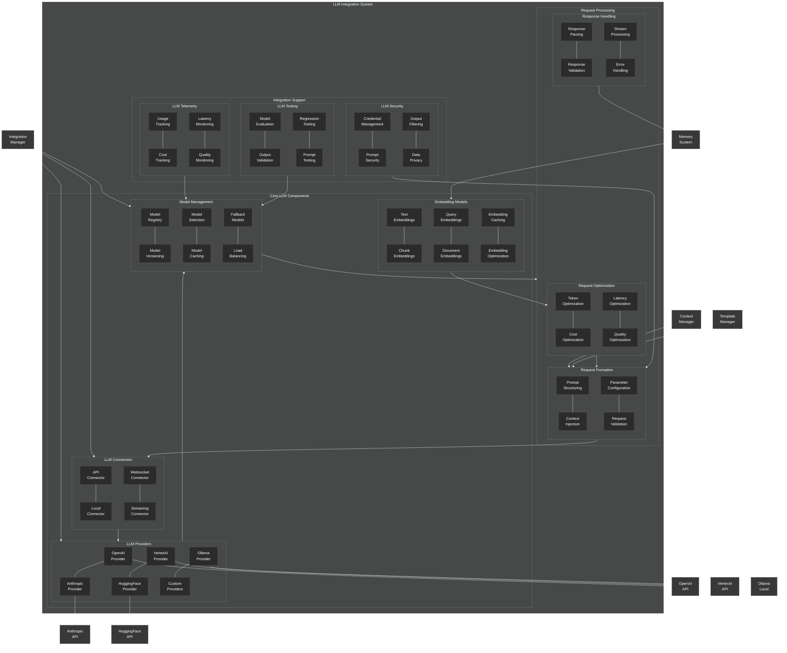

# LLM Integration Architecture

This diagram provides a detailed view of the NeuroCognitive Architecture (NCA) LLM integration system.

## LLM Integration Architecture Components

The NCA LLM integration system provides a framework for connecting the cognitive architecture with various language model providers. It consists of the following key components:

### Core LLM Components

1. **LLM Connectors**:
   - **API Connector**: Connects to LLMs via REST APIs
   - **Local Connector**: Connects to locally hosted LLMs
   - **Websocket Connector**: Connects to LLMs via websocket interfaces
   - **Streaming Connector**: Handles streaming responses from LLMs

2. **LLM Providers**:
   - **OpenAI Provider**: Interface for OpenAI models
   - **Anthropic Provider**: Interface for Anthropic models
   - **VertexAI Provider**: Interface for Google's VertexAI models
   - **HuggingFace Provider**: Interface for HuggingFace models
   - **Ollama Provider**: Interface for local Ollama models
   - **Custom Providers**: Framework for custom LLM interfaces

3. **Model Management**:
   - **Model Registry**: Central registry of available models
   - **Model Versioning**: Manages model versions
   - **Model Selection**: Selects appropriate model based on requirements
   - **Model Caching**: Caches model results for efficiency
   - **Fallback Models**: Provides fallback options when primary models fail
   - **Load Balancing**: Balances load across models

4. **Embedding Models**:
   - **Text Embeddings**: General text embedding capabilities
   - **Chunk Embeddings**: Embeddings for text chunks
   - **Query Embeddings**: Specialized embeddings for queries
   - **Document Embeddings**: Specialized embeddings for documents
   - **Embedding Caching**: Caches embeddings for efficiency
   - **Embedding Optimization**: Optimizes embedding generation

### Request Processing

1. **Request Formation**:
   - **Prompt Structuring**: Formats prompts for optimal LLM interaction
   - **Context Injection**: Injects relevant context into prompts
   - **Parameter Configuration**: Configures request parameters
   - **Request Validation**: Validates requests before sending

2. **Response Handling**:
   - **Response Parsing**: Parses LLM responses
   - **Response Validation**: Validates responses for correctness
   - **Stream Processing**: Processes streaming responses
   - **Error Handling**: Handles errors in LLM responses

3. **Request Optimization**:
   - **Token Optimization**: Optimizes token usage
   - **Cost Optimization**: Optimizes for cost efficiency
   - **Latency Optimization**: Optimizes for low latency
   - **Quality Optimization**: Optimizes for response quality

### Integration Support

1. **LLM Telemetry**:
   - **Usage Tracking**: Tracks LLM usage metrics
   - **Cost Tracking**: Tracks LLM costs
   - **Latency Monitoring**: Monitors response latency
   - **Quality Monitoring**: Monitors response quality

2. **LLM Security**:
   - **Credential Management**: Manages LLM API credentials
   - **Prompt Security**: Ensures prompt security
   - **Output Filtering**: Filters sensitive information from outputs
   - **Data Privacy**: Ensures data privacy in LLM interactions

3. **LLM Testing**:
   - **Model Evaluation**: Evaluates model performance
   - **Output Validation**: Validates model outputs
   - **Regression Testing**: Tests for regressions
   - **Prompt Testing**: Tests prompt effectiveness

### External Connections

The LLM integration system connects with:

- **Integration Manager**: Coordinates LLM integrations
- **Memory System**: Provides embeddings and stores LLM responses
- **Context Manager**: Provides context for LLM requests
- **Template Manager**: Provides templates for LLM requests

The LLM integration system also connects to external LLM provider APIs:

- **OpenAI API**: For OpenAI models
- **Anthropic API**: For Anthropic models
- **VertexAI API**: For Google's VertexAI models
- **HuggingFace API**: For HuggingFace models
- **Ollama Local**: For local Ollama models

The LLM integration system is designed to provide a unified, robust interface to various language models, with support for fallbacks, telemetry, security, and testing.
