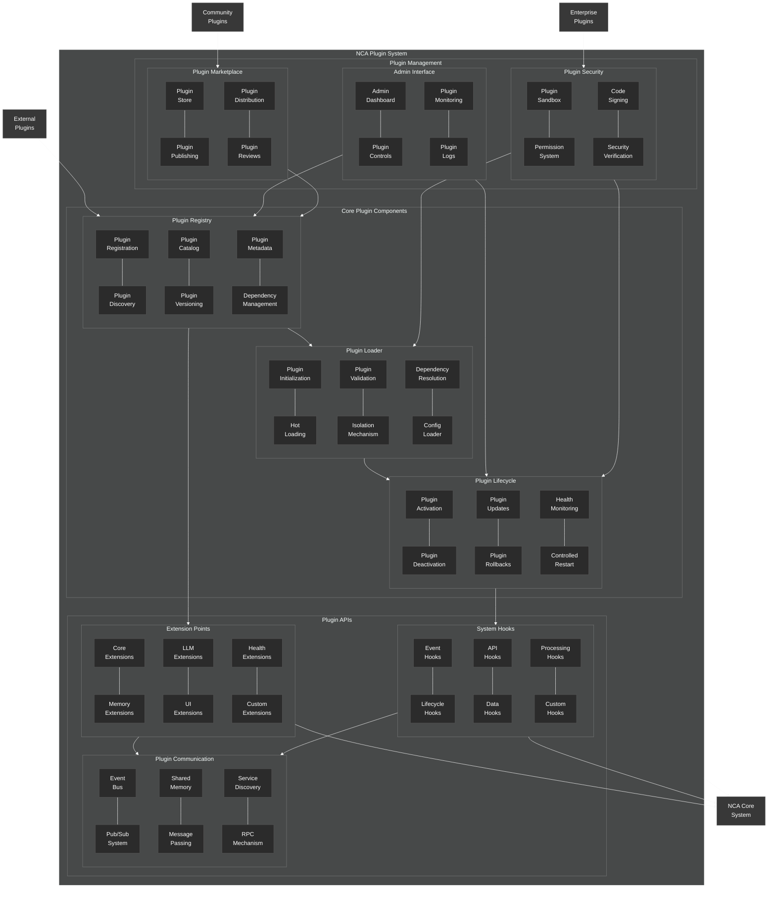

# Plugin System Architecture

This diagram provides a detailed view of the NeuroCognitive Architecture (NCA) plugin system.

## Plugin System Architecture Components

The NCA plugin system provides a framework for extending the functionality of the NeuroCognitive Architecture through plugins. It consists of the following key components:

### Core Plugin Components

1. **Plugin Registry**:
   - **Plugin Registration**: Handles plugin registration
   - **Plugin Discovery**: Discovers available plugins
   - **Plugin Catalog**: Maintains a catalog of available plugins
   - **Plugin Versioning**: Manages plugin versions
   - **Plugin Metadata**: Stores plugin metadata
   - **Dependency Management**: Manages plugin dependencies

2. **Plugin Loader**:
   - **Plugin Initialization**: Initializes plugins
   - **Hot Loading**: Supports loading plugins without restart
   - **Plugin Validation**: Validates plugin integrity and compatibility
   - **Isolation Mechanism**: Isolates plugins from each other
   - **Dependency Resolution**: Resolves plugin dependencies
   - **Config Loader**: Loads plugin configurations

3. **Plugin Lifecycle**:
   - **Plugin Activation**: Activates plugins
   - **Plugin Deactivation**: Deactivates plugins
   - **Plugin Updates**: Handles plugin updates
   - **Plugin Rollbacks**: Supports rolling back plugin updates
   - **Health Monitoring**: Monitors plugin health
   - **Controlled Restart**: Provides controlled restart capabilities

### Plugin APIs

1. **Extension Points**:
   - **Core Extensions**: Extension points for core functionality
   - **Memory Extensions**: Extension points for memory system
   - **LLM Extensions**: Extension points for LLM integration
   - **UI Extensions**: Extension points for user interfaces
   - **Health Extensions**: Extension points for health system
   - **Custom Extensions**: Framework for custom extension points

2. **System Hooks**:
   - **Event Hooks**: Hooks into system events
   - **Lifecycle Hooks**: Hooks into system lifecycle events
   - **API Hooks**: Hooks into API operations
   - **Data Hooks**: Hooks into data operations
   - **Processing Hooks**: Hooks into processing pipelines
   - **Custom Hooks**: Framework for custom hooks

3. **Plugin Communication**:
   - **Event Bus**: System-wide event bus
   - **Pub/Sub System**: Publish/subscribe messaging system
   - **Shared Memory**: Shared memory for inter-plugin communication
   - **Message Passing**: Direct message passing between plugins
   - **Service Discovery**: Discovers services provided by plugins
   - **RPC Mechanism**: Remote procedure call mechanism

### Plugin Management

1. **Admin Interface**:
   - **Admin Dashboard**: Dashboard for plugin management
   - **Plugin Controls**: Controls for plugin operations
   - **Plugin Monitoring**: Monitors plugin status and health
   - **Plugin Logs**: Displays plugin logs

2. **Plugin Marketplace**:
   - **Plugin Store**: Central repository for plugins
   - **Plugin Publishing**: Mechanisms for publishing plugins
   - **Plugin Distribution**: Distributes plugins to systems
   - **Plugin Reviews**: User reviews and ratings for plugins

3. **Plugin Security**:
   - **Plugin Sandbox**: Sandboxes plugins for security
   - **Permission System**: Manages plugin permissions
   - **Code Signing**: Ensures plugin authenticity
   - **Security Verification**: Verifies plugin security

### External Connections

The plugin system connects with:
- **External Plugins**: Third-party plugins
- **Community Plugins**: Plugins from the community
- **Enterprise Plugins**: Plugins from enterprise partners

### Internal Connections

The plugin system connects to:
- **NCA Core System**: Core NeuroCognitive Architecture system

The plugin system is designed to provide a robust, secure, and extensible framework for adding functionality to the NCA, with support for various types of plugins from different sources.
