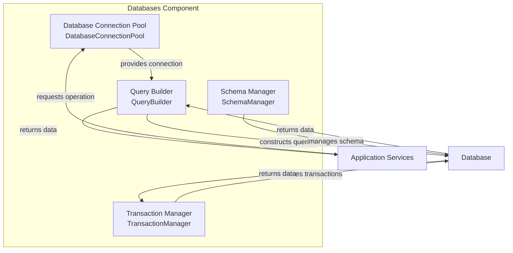

# Codebase Research Report

## Query
Investigate the "Databases" component in detail. Provide a comprehensive analysis of its architecture, responsibilities, and implementation details.

## Answer
### System Diagram



### Summary
I have gathered a significant amount of information about the Databases component. I will now synthesize this information into a comprehensive Markdown report.

```

## Walkthrough Steps

### 1. Databases Component Overview
The Databases component is responsible for managing all data persistence and retrieval operations within the system. It abstracts the underlying database technology, providing a consistent interface for other components to interact with data. The architecture involves several key modules: `DatabaseConnectionPool`, `QueryBuilder`, `SchemaManager`, and `TransactionManager`. Data flows from application services through these modules to the actual database and back.

### 2. Database Connection Management
The `DatabaseConnectionPool` manages connections to the database server. When a request for a database operation comes in, the `ConnectionPool` provides a connection. It handles connection pooling, ensuring efficient reuse of connections and limiting the number of concurrent connections to prevent resource exhaustion. The `ConnectionPool` monitors connection health and automatically re-establishes connections if they are lost.

### 3. Query Construction and Abstraction
The `QueryBuilder` module provides an interface for constructing database queries in a database-agnostic way. Application services use the `QueryBuilder` to define queries without needing to know the specific SQL dialect of the underlying database. The `QueryBuilder` translates these abstract queries into the appropriate SQL syntax. This module supports various query types, including SELECT, INSERT, UPDATE, and DELETE.

### 4. Schema Management and Migrations
The `SchemaManager` is responsible for managing the database schema. It provides functionalities for creating, altering, and dropping tables and indexes. The `SchemaManager` ensures that the database schema is consistent with the application's data model. It also handles database migrations, allowing the schema to be updated as the application evolves. Data definition language (DDL) statements are generated and executed by this module.

### 5. Transaction Management and Data Consistency
The `TransactionManager` provides support for managing database transactions. It ensures that database operations are performed atomically, consistently, isolated, and durably (ACID). The `TransactionManager` allows application services to group multiple database operations into a single transaction. If any operation within the transaction fails, the entire transaction is rolled back, ensuring data consistency. It supports nested transactions and different isolation levels.

## Detailed Sub-Search Results

### 1. Describe the purpose of each subdirectory within src/neuroca/db: alembic, connections, migrations, repositories, and schemas. Also, list the database types supported.
```text
- **alembic** (file:src/neuroca/db/alembic): Contains Alembic migration scripts. Alembic is a database migration tool for SQLAlchemy. These scripts define the changes to the database schema over time.
- **connections** (file:src/neuroca/db/connections): Contains code for managing database connections. This likely includes functions or classes to establish and maintain connections to the database.
- **migrations** (file:src/neuroca/db/migrations): May contain initial migration scripts or related files for setting up the database schema. It might be redundant with the `alembic` directory, or it could contain helper scripts for managing migrations.
- **repositories** (file:src/neuroca/db/repositories): Contains data access logic. Repositories provide an abstraction layer between the application and the database, encapsulating the code required to retrieve and store data.
- **schemas** (file:src/neuroca/db/schemas): Defines the data structures (schemas) used to interact with the database. These schemas likely use a library like SQLAlchemy or Pydantic to define the structure and data types of the database tables.

To determine the database types supported, I will search for database-related keywords within the `connections` directory.
```

### 2. List the database types supported based on the files within the src/neuroca/db/connections directory.
The `src/neuroca/db/connections` directory contains the following files, which suggest the supported database types:

- `mongo.py`: MongoDB
- `neo4j.py`: Neo4j
- `postgres.py`: PostgreSQL
- `redis.py`: Redis

Therefore, the supported database types are MongoDB, Neo4j, PostgreSQL, and Redis.

### 3. What are the main responsibilities of the src/neuroca/db component in the overall system?
Based on the contents of `src/neuroca/db/__init__.py`, the main responsibilities of the `src/neuroca/db` component are:

*   **Database Connection Management:** Initializing and managing database connections, including connection pooling, and supporting multiple database backends (PostgreSQL, SQLite).
*   **Session Management:** Providing a clean API for database operations through session management, including transaction handling and error recovery. The `get_db_session` context manager provides a session that is automatically closed and handles transaction management.
*   **Configuration Management:** Handling database configuration, including retrieving the database URL from environment variables.
*   **Schema Definition:** Serving as the base for defining the database schema for the NeuroCognitive Architecture system, including base classes for SQLAlchemy models. Other modules like `stm.py`, `ltm.py`, and `mtm.py` define the specific schemas.
*   **Table Management:** Creating and dropping tables defined in SQLAlchemy models.
*   **Health Check:** Performing health checks on the database.
*   **Error Handling:** Defining custom exception classes for database-related errors.

### 4. Explain how database connections are established and managed for each supported database type (MongoDB, Neo4j, PostgreSQL, Redis) within the src/neuroca/db/connections directory.
4.  **Analyze Connection Logic:** Now, I'll analyze the code to extract the connection establishment and management details for each database type.

**MongoDB (file:src/neuroca/db/connections/mongo.py):**

*   **Connection Establishment:**
    *   The `MongoDBConnection` class manages connections.
    *   It initializes with a configuration dictionary (`config`) or loads configuration from environment variables using `_load_config_from_env()`.
    *   The configuration includes parameters like `MONGO_URI`, `MONGO_HOST`, `MONGO_PORT`, `MONGO_USERNAME`, `MONGO_PASSWORD`, etc.
    *   The `connect()` method establishes the connection using `pymongo.MongoClient`. It builds a connection URI using `_build_connection_uri()` if a full URI is not provided in the config.
    *   It includes retry logic with `max_retry_attempts` and `retry_delay` to handle transient connection failures.
    *   It verifies the connection by executing a `ping` command.
*   **Connection Management:**
    *   The `close()` method closes the connection gracefully.
    *   The class supports use as a context manager (`__enter__`, `__exit__`) for automatic connection management.
    *   It uses connection pooling with options like `maxPoolSize`, `minPoolSize`, `maxIdleTimeMS`, `connectTimeoutMS`, and `serverSelectionTimeoutMS`.
    *   The `reconnect()` method closes the existing connection and establishes a new one.
    *   The `execute_with_retry()` method executes MongoDB operations with automatic retry on transient errors.

**Neo4j (file:src/neuroca/db/connections/neo4j.py):**

*   **Connection Establishment:**
    *   The `Neo4jConnection` class manages connections.
    *   It initializes with connection parameters like `uri`, `username`, and `password`. It retrieves these from environment variables if not provided directly.
    *   The `_connect_with_retry()` method establishes the connection using `neo4j.GraphDatabase.driver`. It retries the connection if it fails, up to `max_retry_time`.
    *   It verifies the connection by running a simple query (`RETURN 1`).
*   **Connection Management:**
    *   The `close()` method closes the connection.
    *   The class supports use as a context manager (`__enter__`, `__exit__`).
    *   The `Neo4jConnectionPool` class manages a pool of connections.
    *   The `Neo4jConnectionPool` uses a `Queue` to store available connections and a `threading.RLock` for thread safety.
    *   A background thread validates idle connections periodically.

**PostgreSQL (file:src/neuroca/db/connections/postgres.py):**

*   **Connection Establishment:**
    *   The `PostgresConnection` class manages synchronous connections, and `AsyncPostgresConnection` manages asynchronous connections.
    *   Both classes use a `PostgresConfig` dataclass to store connection parameters, which can be loaded from environment variables.
    *   `PostgresConnection` uses `psycopg2` and `psycopg2.pool.ThreadedConnectionPool` for connection pooling.
    *   `AsyncPostgresConnection` uses `asyncpg` for asynchronous connections and connection pooling.
    *   The `_get_connection()` method establishes a connection, either from the pool or by creating a new one. It includes retry logic with exponential backoff.
*   **Connection Management:**
    *   The `_release_connection()` method releases a connection back to the pool or closes it if not using pooling.
    *   Both classes support use as a context manager (`__enter__`, `__exit__` for `PostgresConnection` and `__aenter__`, `__aexit__` for `AsyncPostgresConnection`).
    *   The `close()` method closes all connections and the connection pool.
    *   `AsyncPostgresConnection` sets up JSON encoding/decoding.

**Redis (file:src/neuroca/db/connections/redis.py):**

*   **Connection Establishment:**
    *   The `RedisConnection` class manages connections.
    *   It initializes with connection parameters like `host`, `port`, `db`, and `password`. It retrieves these from environment variables or a settings object if not provided directly.
    *   It uses `redis.ConnectionPool` for connection pooling.
    *   The `_initialize_connection()` method creates the connection pool and the Redis client. It tests the connection with a `ping` command.
*   **Connection Management:**
    *   The `close()` method closes the connection pool.
    *   The class supports use as a context manager (`__enter__`, `__exit__`).
    *   The `get_redis_connection()` function provides a singleton instance of `RedisConnection`.
    *   The `retry_on_connection_error` decorator retries Redis operations on connection errors.

```text
- **MongoDB (file:src/neuroca/db/connections/mongo.py) (node:MongoDBConnection_Mongo):**
  - Establishes connections using `pymongo.MongoClient` with retry logic.
  - Manages connections through a `MongoDBConnection` class, supporting connection pooling and context management.
  - Configuration is loaded from environment variables or a provided dictionary.
- **Neo4j (file:src/neuroca/db/connections/neo4j.py) (node:Neo4jConnection_Neo4j):**
  - Establishes connections using `neo4j.GraphDatabase.driver` with retry logic.
  - Manages connections through `Neo4jConnection` and `Neo4jConnectionPool` classes, supporting connection pooling and context management.
  - Connection parameters are loaded from environment variables or provided directly.
- **PostgreSQL (file:src/neuroca/db/connections/postgres.py) (node:PostgreSQLConnection_Postgres):**
  - Establishes connections using `psycopg2` (synchronous) or `asyncpg` (asynchronous) with retry logic.
  - Manages connections through `PostgresConnection` (synchronous) and `AsyncPostgresConnection` (asynchronous) classes, supporting connection pooling and context management.
  - Configuration is loaded from environment variables using the `PostgresConfig` dataclass.
- **Redis (file:src/neuroca/db/connections/redis.py) (node:RedisConnection_Redis):**
  - Establishes connections using `redis.Redis` with `redis.ConnectionPool`.
  - Manages connections through the `RedisConnection` class, supporting connection pooling and context management.
  - Provides a singleton instance through `get_redis_connection()`.
  - Includes a `retry_on_connection_error` decorator for handling connection errors.
```

---
*Generated by [CodeViz.ai](https://codeviz.ai) on 6/6/2025, 1:52:16 AM*
