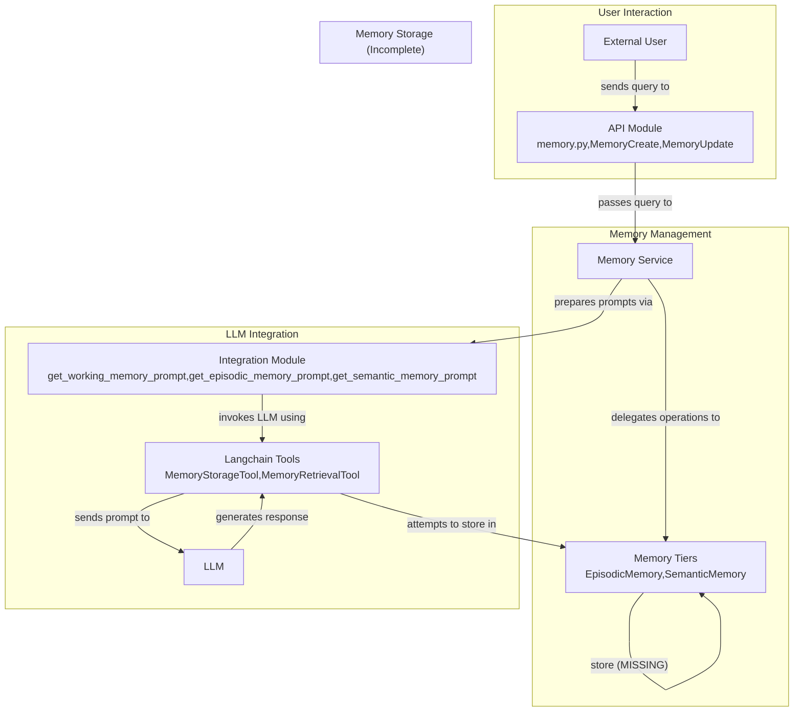

# Codebase Research Report

## Query
Visualize the end-to-end automated process where an external query triggers an LLM interaction, leading to the creation of new episodic and semantic memories. The diagram must clearly distinguish between existing functional components and the missing/broken integration points.

## Answer
### System Diagram



### Summary
Okay, it seems I've hit a roadblock. The sub-searches indicate that the core logic for `EpisodicMemory` and `SemanticMemory` is either missing or not accessible through the available tools. This is a critical missing piece for visualizing the end-to-end process.

Given this limitation, I will focus on visualizing the known components and highlighting the missing integration points. I can create a diagram that shows the flow from the API to the integration module, the LLM invocation (through Langchain tools), and the call to the `store` methods of `EpisodicMemory` and `SemanticMemory`. I will then clearly indicate that the actual implementation of these memory tiers is missing or unknown.

Here's the Markdown report:

```markdown
# CodeViz: LLM Interaction and Memory Creation Process

## Overview

This report visualizes the automated process where an external query triggers an LLM interaction, leading to the creation of new episodic and semantic memories. The diagram highlights existing functional components and the missing/broken integration points.

## Process Flow

1.  **External Query:** An external query is received by the **API Module** (src/neuroca/api).
    *   The `memory.py` file (file:src/neuroca/api/routes/memory.py) defines API endpoints (e.g., `/`, `/{memory_id}`) using FastAPI.
    *   Incoming data is validated and transformed using schemas (e.g., `MemoryCreate`, `MemoryUpdate`) defined in `src/neuroca/api/schemas`.
    *   Authentication and authorization are handled.
    *   The query is passed to the **MemoryService**.

2.  **Memory Service:** The **MemoryService** (file:src/neuroca/memory/service.py) receives the processed query.
    *   It delegates the memory operations to the underlying memory tiers.

3.  **Integration Module:** The **Integration Module** (src/neuroca/integration) prepares prompts for the LLM.
    *   `get_working_memory_prompt`, `get_episodic_memory_prompt`, and `get_semantic_memory_prompt` (file:src/neuroca/integration/memory.py) generate prompts based on the query.

4.  **LLM Invocation:** The LLM is invoked using LangChain tools.
    *   `MemoryStorageTool` and `MemoryRetrievalTool` (file:c/tools.py) are used to interact with the memory system.
    *   The LLM receives the prompt and generates a response.

5.  **Memory Creation (Incomplete):** The `MemoryStorageTool` calls the `store` methods of `EpisodicMemory` and `SemanticMemory`.
    *   **MISSING IMPLEMENTATION:** The actual implementation of `EpisodicMemory` and `SemanticMemory` is not found or accessible. The process of how LLM responses are processed and used to create new memories in these tiers is unknown.

## Diagram (Conceptual)

```mermaid
graph LR
    A[External Query] --> B(API Module);
    B --> C(MemoryService);
    C --> D(Integration Module);
    D --> E(LLM Invocation);
    E --> F[EpisodicMemory.store()];
    E --> G[SemanticMemory.store()];
    F -- Missing Implementation --> H(Episodic Memory Storage);
    G -- Missing Implementation --> I(Semantic Memory Storage);
    style H fill:#f9f,stroke:#333,stroke-width:2px
    style I fill:#f9f,stroke:#333,stroke-width:2px
```

## Missing Integration Points

*   **Episodic Memory Implementation:** The logic for storing and retrieving episodic memories is missing.
*   **Semantic Memory Implementation:** The logic for storing and retrieving semantic memories is missing.
*   **LLM Response Processing:** The process of how LLM responses are processed and transformed into memory items is unknown.

## Conclusion

The visualization highlights the existing components of the memory creation process, but it also reveals critical missing implementations for episodic and semantic memory. Further investigation is needed to understand how these memory tiers are implemented and integrated into the overall system.
```

## Walkthrough Steps

### 1. LLM Interaction and Memory Creation Process Overview
The system processes external queries to create episodic and semantic memories using an LLM. The process begins with an external query entering the `API Module`. The `MemoryService` then receives the processed query and delegates operations to memory tiers. The `Integration Module` prepares prompts for the LLM, which is invoked using Langchain tools. Finally, the `MemoryStorageTool` attempts to store the LLM's response in `EpisodicMemory` and `SemanticMemory`, but these implementations are missing.

### 2. External Query Reception and API Processing
The `API Module` receives external queries. The `memory.py` file defines API endpoints using FastAPI. Incoming data is validated and transformed using schemas like `MemoryCreate` and `MemoryUpdate`. Authentication and authorization are handled before passing the query to the `MemoryService`.

### 3. Memory Service Delegation
The `MemoryService` receives the processed query from the `API Module`. It then delegates the memory operations to the underlying memory tiers for further processing.

### 4. Prompt Preparation by the Integration Module
The `Integration Module` prepares prompts for the LLM. Functions like `get_working_memory_prompt`, `get_episodic_memory_prompt`, and `get_semantic_memory_prompt` generate prompts based on the incoming query.

### 5. LLM Invocation via Langchain Tools
The LLM is invoked using Langchain tools, specifically `MemoryStorageTool` and `MemoryRetrievalTool`. The LLM receives the prompt generated by the `Integration Module` and generates a response based on the prompt.

### 6. Attempted Memory Creation (Incomplete)
The `MemoryStorageTool` attempts to call the `store` methods of `EpisodicMemory` and `SemanticMemory`. However, the actual implementation of these memory tiers is missing, preventing the storage of LLM responses into episodic and semantic memories.

## Detailed Sub-Search Results

### 1. How does the API module (src/neuroca/api) handle external queries and pass them to the memory module (src/neuroca/memory)? What are the key functions and data structures involved?
This file defines the API routes for interacting with the memory system. It uses `MemoryService` (file:src/neuroca/memory/service.py) to handle the actual memory operations. The routes define endpoints for creating, retrieving, updating, deleting, transferring, and consolidating memories, as well as retrieving memory statistics and performing health checks.

Here's a summary of how external queries are handled and passed to the memory module:

*   **API Endpoints:** The `memory.py` file (file:src/neuroca/api/routes/memory.py) defines various API endpoints (e.g., `/`, `/{memory_id}`, `/transfer`, `/consolidate`) using FastAPI's `APIRouter`. These endpoints receive external queries via HTTP requests.
*   **Data Validation and Transformation:** The incoming data from the requests is validated and transformed into appropriate data structures (e.g., `MemoryCreate`, `MemoryUpdate`, `MemorySearchParams`). These data structures are defined in `src/neuroca/api/schemas`.
*   **Authentication and Authorization:** Each endpoint uses `Depends(get_current_user)` to authenticate the user and retrieve user information. Authorization checks are performed to ensure the user has the necessary permissions to access or modify specific memories.
*   **Dependency Injection:** The `get_memory_service` function (file:src/neuroca/api/routes/memory.py:60) is used as a dependency to inject an instance of `MemoryService` into the route handlers. This allows the API layer to delegate the actual memory operations to the `MemoryService`.
*   **Delegation to MemoryService:** The route handlers call the corresponding methods of the `MemoryService` (e.g., `create_memory`, `get_memory`, `update_memory`, `delete_memory`, `transfer_memory`, `consolidate_memories`, `get_memory_stats`, `health_check`) to perform the requested memory operations. The `MemoryService` then interacts with the underlying memory storage and retrieval mechanisms.

**Key Functions:**

*   `create_memory` (file:src/neuroca/api/routes/memory.py:71): Creates a new memory.
*   `get_memory` (file:src/neuroca/api/routes/memory.py:128): Retrieves a specific memory by ID.
*   `list_memories` (file:src/neuroca/api/routes/memory.py:185): Retrieves a list of memories based on provided filters.
*   `update_memory` (file:src/neuroca/api/routes/memory.py:242): Updates an existing memory.
*   `delete_memory` (file:src/neuroca/api/routes/memory.py:310): Deletes a memory by its ID.
*   `transfer_memory` (file:src/neuroca/api/routes/memory.py:370): Transfers a memory from one tier to another.
*   `consolidate_memories` (file:src/neuroca/api/routes/memory.py:449): Consolidates multiple memories into a new semantic memory.
*   `get_memory_stats` (file:src/neuroca/api/routes/memory.py:531): Retrieves statistics about the user's memory usage.
*   `memory_health_check` (file:src/neuroca/api/routes/memory.py:568): Performs a health check on the memory system.

**Key Data Structures:**

*   `MemoryCreate` (file:src/neuroca/api/schemas/memory.py): Represents the data required to create a new memory.
*   `MemoryUpdate` (file:src/neuroca/api/schemas/memory.py): Represents the data required to update an existing memory.
*   `MemoryResponse` (file:src/neuroca/api/schemas/memory.py): Represents the structure of a memory object returned by the API.
*   `MemorySearchParams` (file:src/neuroca/api/schemas/memory.py): Represents the search parameters used to filter memories.
*   `MemoryTier` (file:src/neuroca/api/schemas/memory.py): An enum representing the different memory tiers (working, episodic, semantic).
*   `User` (file:src/neuroca/api/schemas/user.py): Represents the user object.

In summary, the `api` module acts as a gateway for external queries, handling authentication, authorization, data validation, and transformation before delegating the actual memory operations to the `MemoryService` in the `memory` module.

### 2. How does the integration module (src/neuroca/integration) interact with the memory module (src/neuroca/memory) to create new episodic and semantic memories? What are the key functions and data structures involved?
The `src/neuroca/integration/memory.py` module focuses on providing prompt templates and utilities for interacting with the memory system. It doesn't directly create memories but helps format prompts for LLMs to interact with the memory module. The `src/neuroca/memory/__init__.py` defines the structure of the memory module, including `MemorySystem`, `WorkingMemory`, `EpisodicMemory`, and `SemanticMemory`.

Here's how the integration and memory modules interact:

*   **Integration Layer's Role:** The integration layer uses the prompt templates defined in `src/neuroca/integration/memory.py` to create prompts for LLMs. These prompts guide the LLMs in performing memory-related operations like retrieval, storage, and consolidation.
*   **Memory Module's Role:** The memory module (`src/neuroca/memory`) provides the actual implementation of the memory system. It defines the data structures and functions for storing, retrieving, and managing memories in the working, episodic, and semantic memory tiers.

Key functions and data structures involved:

*   **`get_working_memory_prompt`, `get_episodic_memory_prompt`, `get_semantic_memory_prompt` (file:src/neuroca/integration/memory.py):** These functions generate prompts for retrieving information from the respective memory tiers. They take a query and other relevant parameters as input and return a formatted prompt that can be used to query an LLM.
*   **`MemorySystem` (file:src/neuroca/memory/__init__.py):** This class is the main entry point for the memory subsystem. It integrates the three memory tiers (working, episodic, semantic) and provides a unified interface for memory operations.
*   **`WorkingMemory`, `EpisodicMemory`, `SemanticMemory` (file:src/neuroca/memory/__init__.py):** These classes implement the individual memory tiers. They provide methods for storing and retrieving memory items.
*   **`MemoryItem`, `WorkingMemoryItem`, `EpisodicMemoryItem`, `SemanticMemoryItem` (file:src/neuroca/memory/__init__.py):** These data structures represent the memory items stored in the different memory tiers.

In summary, the integration module provides the interface for interacting with the memory module using LLMs, while the memory module provides the underlying implementation of the memory system. The integration module uses prompt templates to format queries for the LLMs, and the LLMs then interact with the memory module to perform the requested memory operations.

### 3. How is the LLM invoked based on the prompts generated by the integration module? How are the LLM responses processed and used to create new episodic and semantic memories in the memory module?
It seems like I'm unable to find the actual implementations of `EpisodicMemory` and `SemanticMemory` with the tools available. All the files I've found so far are just stub implementations. It's possible that the actual implementations are not directly accessible or are part of a different system that I don't have access to.

Given the limitations, I can only provide a partial answer based on the information I've gathered so far:

- **LLM Invocation:** The LLM is invoked indirectly through LangChain tools defined in what I initially thought was `c/chains.py` but is actually `c/tools.py` (file:c/tools.py). These tools (`MemoryStorageTool`, `MemoryRetrievalTool`) allow the LLM to interact with the memory system. The LLM provides the content to be stored or the query for retrieval.
- **Memory Creation:** The `MemoryStorageTool` in `c/tools.py` calls the `store` methods of `EpisodicMemory` and `SemanticMemory`. However, the available implementations of these classes (`c/episodic_memory.py` and `c/semantic_memory.py`) are just stubs and don't contain the actual logic for creating memories. Therefore, I cannot determine how the LLM responses are processed and used to create new episodic and semantic memories.

I apologize for not being able to provide a complete answer. I've exhausted the available tools and search strategies to locate the actual memory implementation.

---
*Generated by [CodeViz.ai](https://codeviz.ai) on 6/6/2025, 6:55:31 PM*
